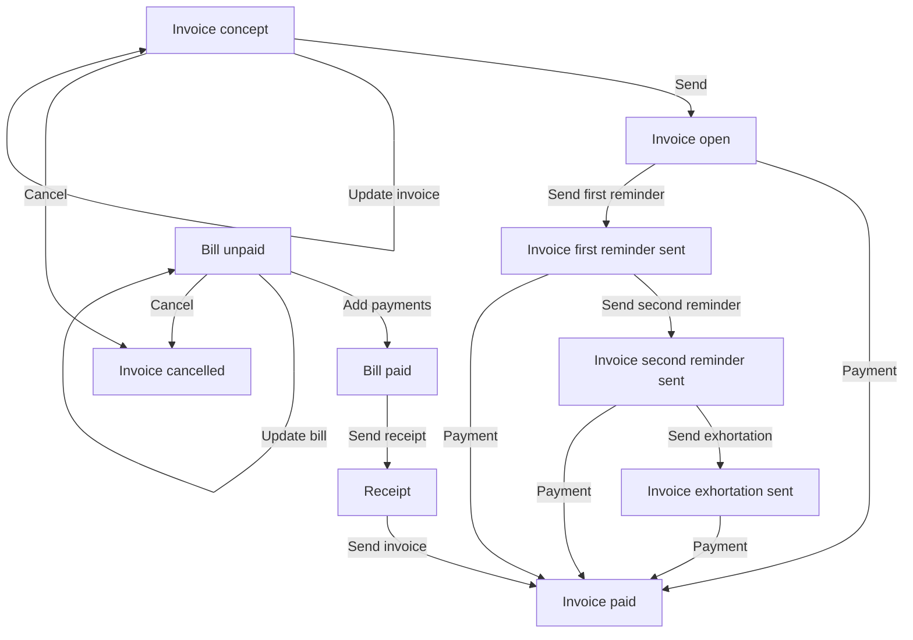

```mermaid
graph TD;
    invoiceconcept[Invoice concept]-->|Send|invoiceopen[Invoice open]
    invoiceconcept-->|Update invoice|invoiceconcept
    invoiceopen-->|Payment|invoicepaid[Invoice paid]
    invoiceopen-->|Send first reminder|invoicefirstremindersent[Invoice first reminder sent]
    invoicefirstremindersent-->|Send second reminder|invoicesecondremindersent[Invoice second reminder sent]
    invoicesecondremindersent-->|Send exhortation|invoiceexhortationsent[Invoice exhortation sent]
    invoicefirstremindersent-->|Payment|invoicepaid
    invoicesecondremindersent-->|Payment|invoicepaid
    invoiceexhortationsent-->|Payment|invoicepaid
    billunpaid[Bill unpaid]-->|Add payments|billpaid[Bill paid]
    billunpaid-->|Update bill|billunpaid
    billpaid-->|Send receipt|receipt[Receipt]
    receipt-->|Send invoice|invoicepaid
    billunpaid-->|Cancel|invoicecanceled[Invoice cancelled]
    invoiceconcept-->|Cancel|invoicecanceled
```